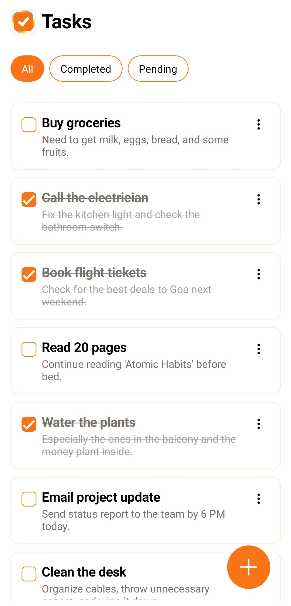
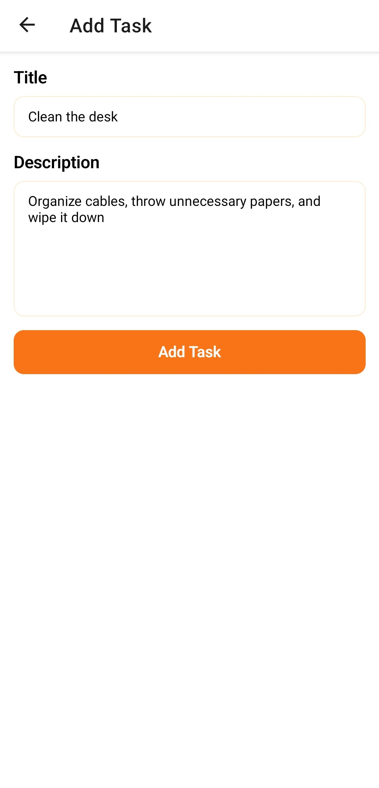
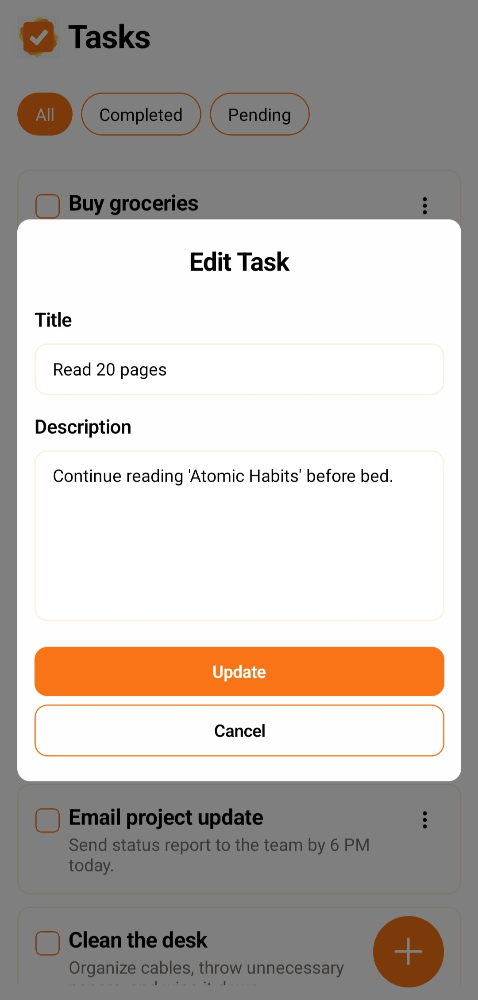

# 📋 Tasks

**Tasks** is a basic yet functional **To-Do App** built while learning **React Native** and **Expo**. This app allows users to add, complete, and delete tasks, serving as a hands-on introduction to mobile development using modern JavaScript tools.

## 🚀 Features

- ✅ Add new tasks
- 🗑️ Delete existing tasks
- ✔️ Mark tasks as completed
- 💾 Persistent storage using local device storage
- 💡 Clean and minimal UI with basic component styling

---

## 📦 Tech Stack

- [React Native](https://reactnative.dev/)
- [Expo](https://expo.dev/)
- [React-Native-MMKV](https://npmjs.com/package/react-native-mmkv)

---

## 📥 Installation

Follow these steps to clone and run the app on your local device or emulator.

### 1. Clone the Repository

```bash
git clone https://github.com/your-username/tasks.git
cd tasks
```

2. Install NPM packages

```bash
npm install
```

3. Run locally

- Expo (Go)

```bash
npm start
```

- Android

```bash
npm run android
```

- IOS

```bash
npm run ios
```

## 📷 Screenshots

<div style="display: flex; justify-content: space-between;">
    <div style="margin-left: 10;">
        <h2 style="text-align: center;">Home</h2>
        
    </div>
    <div style="margin-left: 10;">
        <h2 style="text-align: center;">Add Task</h2>
        
    </div>
    <div style="margin-left: 10;">
        <h2 style="text-align: center;">Edit Task</h2>
        
    </div>
</div>
